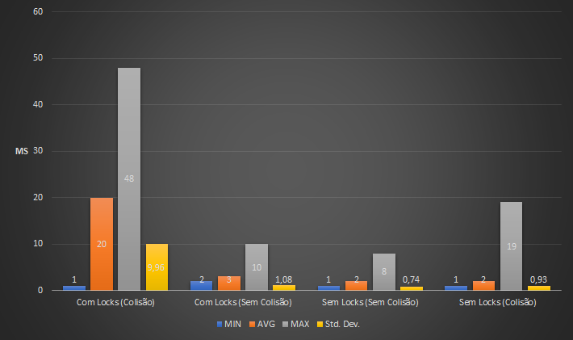

# MiniRedis API
Implementação de um subset de comandos do [Redis](https://redis.io) utilizando Python, com as seguintes bibliotecas e/ou frameworks:
- [Flask](http://flask.pocoo.org) - Mini-framework utilizado para criação de uma aplicação web com Python.
- [Flask-RESTPlus](https://flask-restplus.readthedocs.io/en/stable/#) - Extensão do Flask que facilita a criação de API's REST.
- [ASGI](https://github.com/django/asgiref/) - Contém funções utilitárias para conversão de funções assíncronas em síncronas.

# Comandos
Os comandos implementados foram os seguintes:
- SET key value
- SET key value EX seconds
- GET key
- DEL key
- DBSIZE
- INCR key
- ZADD key score member
- ZCARD key
- ZRANK key member
- ZRANGE key start stop

# Utilização
Os comandos podem ser utilizados através do próprio Swagger gerado pela aplicação, ou por um cliente REST qualquer. O formato de request é similar aos originais, porém a chave sempre faz parte da URL base, e o resto dos parâmetros é passado normalmente.

# Implementação
- Os SortedSets foram implementados utilizando a classe OrderedDict do próprio Python, reordenando os elementos pelo score sempre que estes são atualizados. 
- A aplicação possui a funcionalidade de realizar um backup dos dados em memória a cada 30 minutos (valor modificável) no formato JSON.
- O controle das threads foi feito de acordo com cada chave utilizada para armazenar dados, ou seja, o bloqueio é feito individualmente para cada chave, e não por método.

# Desempenho
Para tomar a decisão de manter ou não o controle das threads com utilização de mutex, foram feitos benchmarks através do JMeter para medir o tempo de execução das requests tanto no sistema utilizando mutex, quanto não utilizando, assim como fazendo requests forçando a ocorrência de situações de corrida, e também evitando esse tipo de situação. Ao comparar os resultados, notou-se que houve uma queda de performance ao utilizar os mutex's, mas a diferença ficou dentro do aceitável, considerando a segurança adquirida com a mudança de abordagem. A comparação pode ser observada no seguinte gráfico:

